# Architecture Diagram

> **Project:** veil7  
> **Version:** 1.0  
> **Last Updated:** 2026-06-15  
> **Status:** Production-Ready

---

## Table of Contents

1. [Overall Architecture](#1-overall-architecture)
2. [Data Flow Diagram](#2-data-flow-diagram)
3. [Component Interaction](#3-component-interaction)
4. [Trust Boundaries](#4-trust-boundaries)
5. [Attack Surfaces](#5-attack-surfaces)
6. [Layer-by-Layer Breakdown](#6-layer-by-layer-breakdown)
7. [Security Properties](#7-security-properties)

---

## 1. Overall Architecture

### High-Level Architecture Diagram

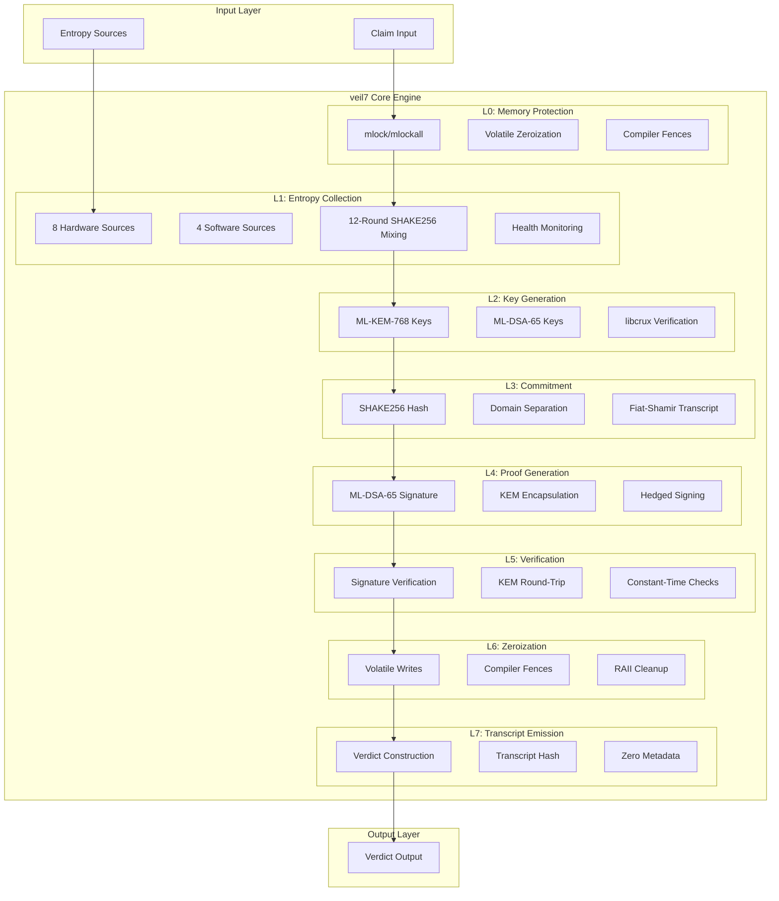

### System Architecture Overview

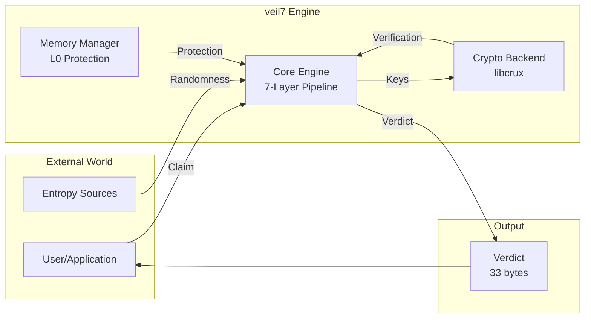

---

## 2. Data Flow Diagram

### End-to-End Data Flow

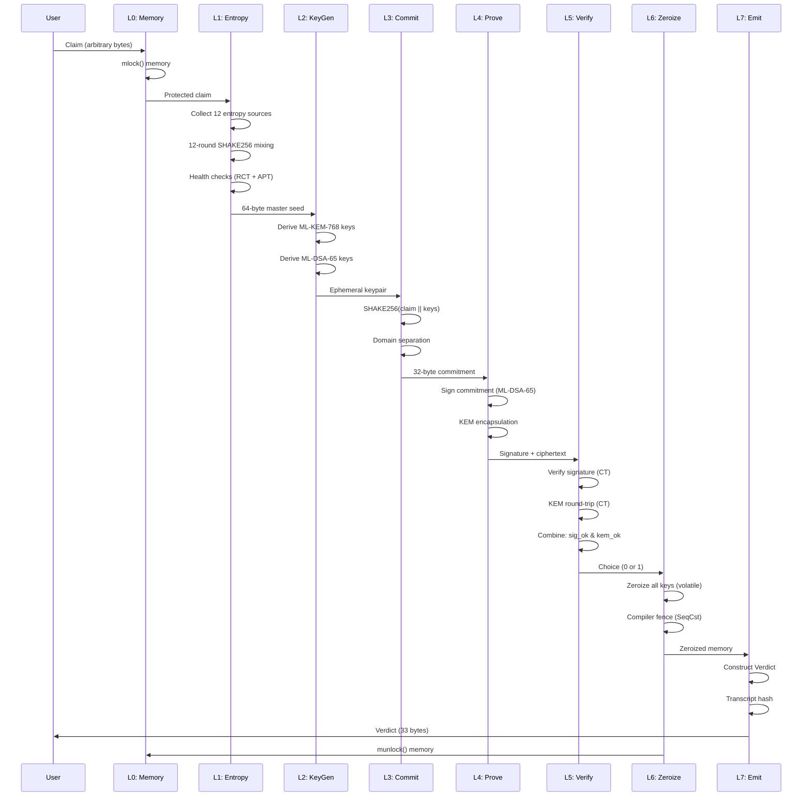

### Detailed Data Flow per Layer

```mermaid
flowchart TB
    subgraph Input
        Claim[Claim: arbitrary bytes]
        Entropy[Entropy: 12 sources]
    end
    
    subgraph "L0: Memory Protection"
        L0_in[Input: claim]
        L0_lock[mlock memory]
        L0_out[Protected claim]
        L0_in --> L0_lock --> L0_out
    end
    
    subgraph "L1: Entropy Collection"
        L1_in[Input: 12 sources]
        L1_mix[12-round SHAKE256]
        L1_health[Health checks]
        L1_out[64-byte seed]
        L1_in --> L1_mix --> L1_health --> L1_out
    end
    
    subgraph "L2: Key Generation"
        L2_in[Input: 64-byte seed]
        L2_kem[ML-KEM-768 keys]
        L2_dsa[ML-DSA-65 keys]
        L2_out[Ephemeral keypair]
        L2_in --> L2_kem --> L2_dsa --> L2_out
    end
    
    subgraph "L3: Commitment"
        L3_in[Input: claim + keys]
        L3_hash[SHAKE256 hash]
        L3_domain[Domain separation]
        L3_out[32-byte commitment]
        L3_in --> L3_hash --> L3_domain --> L3_out
    end
    
    subgraph "L4: Proof Generation"
        L4_in[Input: commitment + keys]
        L4_sig[ML-DSA-65 signature]
        L4_kem[KEM encapsulation]
        L4_out[Signature + ciphertext]
        L4_in --> L4_sig --> L4_kem --> L4_out
    end
    
    subgraph "L5: Verification"
        L5_in[Input: signature + ciphertext]
        L5_sig[Signature verification]
        L5_kem[KEM round-trip]
        L5_combine[Combine: sig_ok & kem_ok]
        L5_out[Choice: 0 or 1]
        L5_in --> L5_sig --> L5_kem --> L5_combine --> L5_out
    end
    
    subgraph "L6: Zeroization"
        L6_in[Input: all keys]
        L6_volatile[Volatile writes]
        L6_fence[Compiler fence]
        L6_out[Zeroized memory]
        L6_in --> L6_volatile --> L6_fence --> L6_out
    end
    
    subgraph "L7: Transcript Emission"
        L7_in[Input: Choice + transcript]
        L7_verdict[Verdict construction]
        L7_hash[Transcript hash]
        L7_out[Verdict: 33 bytes]
        L7_in --> L7_verdict --> L7_hash --> L7_out
    end
    
    Claim --> L0_in
    Entropy --> L1_in
    L0_out --> L1_in
    L1_out --> L2_in
    L2_out --> L3_in
    L3_out --> L4_in
    L4_out --> L5_in
    L5_out --> L6_in
    L6_out --> L7_in
```

---

## 3. Component Interaction

### Component Interaction Diagram

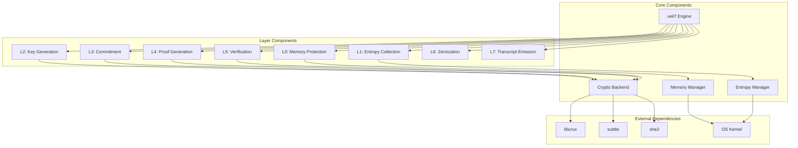

### API Interaction Flow

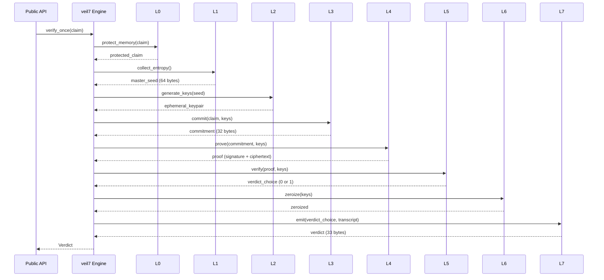

---

## 4. Trust Boundaries

### Trust Boundary Diagram

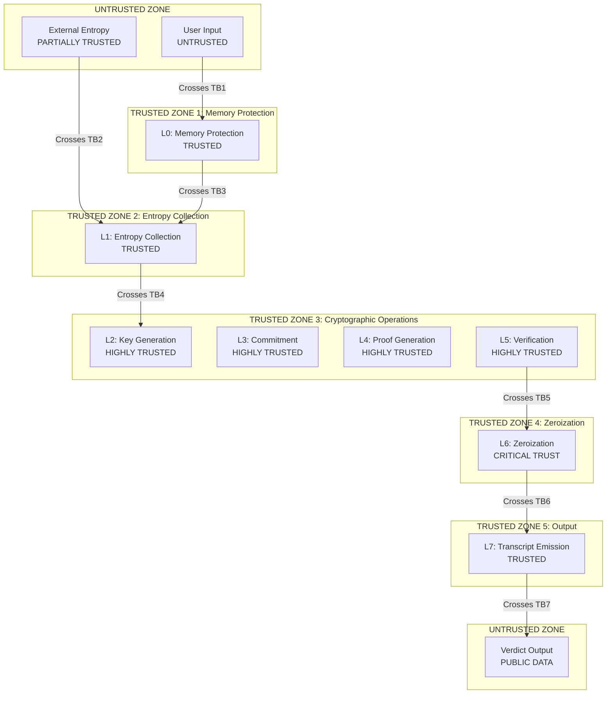

### Trust Level per Layer

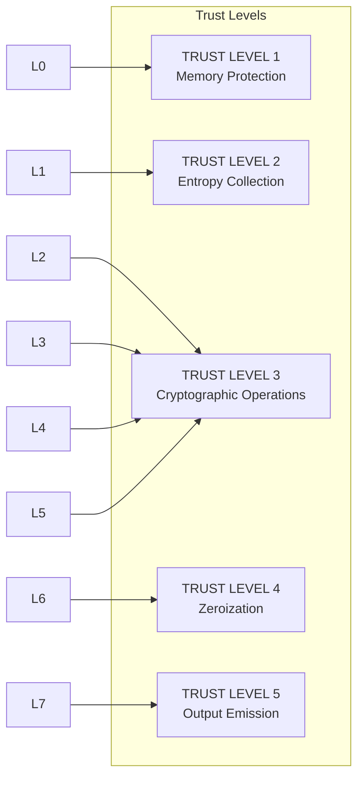

---

## 5. Attack Surfaces

### Attack Surface Diagram

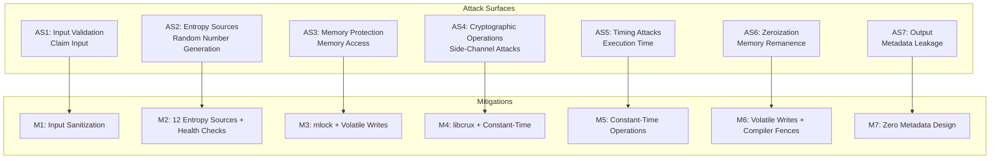

### Attack Vector Mitigation Matrix

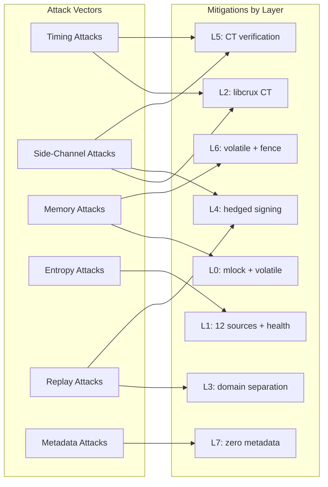

---

## 6. Layer-by-Layer Breakdown

### Layer Architecture Overview

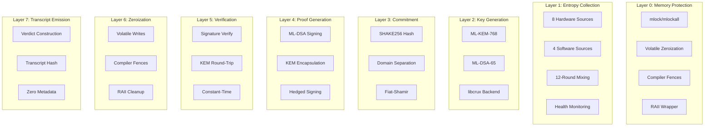

### Layer Dependencies

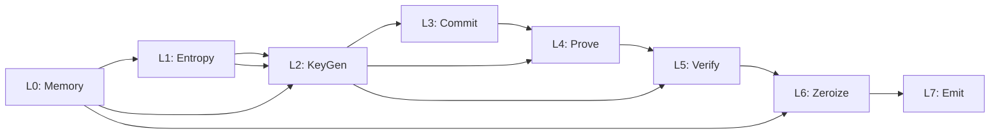

---

## 7. Security Properties

### Security Properties per Layer

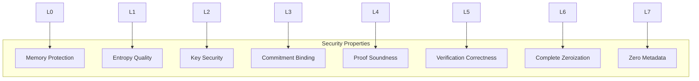

### Security Property Verification

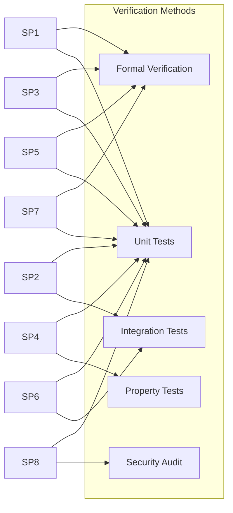

---

## Appendix A: Component Details

### L0: Memory Protection Components

| Component | Purpose | Implementation |
|-----------|---------|----------------|
| `mlock()` | Lock memory pages | POSIX system call |
| `mlockall()` | Lock all memory | POSIX system call |
| `write_volatile()` | Prevent optimization | Rust core::ptr |
| `compiler_fence()` | Prevent reordering | Rust core::sync::atomic |
| `Zeroizing<T>` | RAII wrapper | Custom implementation |

### L1: Entropy Collection Components

| Component | Purpose | Implementation |
|-----------|---------|----------------|
| Hardware sources | High-quality randomness | RDRAND, RDSEED, etc. |
| Software sources | Fallback entropy | Timing, memory layout |
| SHAKE256 mixing | Entropy conditioning | libcrux-sha3 |
| RCT test | Detect stuck sources | NIST SP 800-90B |
| APT test | Detect biased sources | NIST SP 800-90B |

### L2: Key Generation Components

| Component | Purpose | Implementation |
|-----------|---------|----------------|
| ML-KEM-768 | Key encapsulation | libcrux-ml-kem |
| ML-DSA-65 | Digital signatures | libcrux-ml-dsa |
| Key derivation | Seed expansion | SHAKE256 |
| Constant-time | Timing protection | libcrux CT |

### L3: Commitment Components

| Component | Purpose | Implementation |
|-----------|---------|----------------|
| SHAKE256 hash | Commitment function | libcrux-sha3 |
| Domain separation | Prevent cross-layer | Custom domain tags |
| Fiat-Shamir | Non-interactive proof | Transcript accumulator |

### L4: Proof Generation Components

| Component | Purpose | Implementation |
|-----------|---------|----------------|
| ML-DSA signing | Signature generation | libcrux-ml-dsa |
| KEM encapsulation | Key encapsulation | libcrux-ml-kem |
| Hedged signing | Nonce protection | H(sk \|\| msg \|\| random) |
| Constant-time | Timing protection | libcrux CT |

### L5: Verification Components

| Component | Purpose | Implementation |
|-----------|---------|----------------|
| Signature verify | Signature verification | libcrux-ml-dsa |
| KEM round-trip | Key consistency | libcrux-ml-kem |
| Constant-time | Timing protection | subtle::Choice |
| Dual checks | Defense-in-depth | sig_ok & kem_ok |

### L6: Zeroization Components

| Component | Purpose | Implementation |
|-----------|---------|----------------|
| Volatile writes | Prevent optimization | Rust core::ptr |
| Compiler fences | Prevent reordering | Rust core::sync::atomic |
| RAII cleanup | Automatic cleanup | Custom Drop impl |
| Multi-pass | Defense-in-depth | 4-layer protection |

### L7: Transcript Emission Components

| Component | Purpose | Implementation |
|-----------|---------|----------------|
| Verdict construction | Output formatting | Custom Verdict struct |
| Transcript hash | Binding proof | SHAKE256 |
| Zero metadata | Privacy protection | 33 bytes only |

---

## Appendix B: Data Flow Details

### Input Data

| Data | Size | Source | Trust Level |
|------|------|--------|-------------|
| Claim | Arbitrary | User | UNTRUSTED |
| Entropy | 12 sources | Hardware + Software | PARTIALLY TRUSTED |

### Intermediate Data

| Data | Size | Layer | Trust Level |
|------|------|-------|-------------|
| Protected claim | Arbitrary | L0 | TRUSTED |
| Master seed | 64 bytes | L1 | TRUSTED |
| Ephemeral keypair | Variable | L2 | HIGHLY TRUSTED |
| Commitment | 32 bytes | L3 | HIGHLY TRUSTED |
| Signature + ciphertext | Variable | L4 | HIGHLY TRUSTED |
| Verdict choice | 1 bit | L5 | HIGHLY TRUSTED |
| Zeroized memory | N/A | L6 | CRITICAL |

### Output Data

| Data | Size | Layer | Trust Level |
|------|------|-------|-------------|
| Verdict | 33 bytes | L7 | PUBLIC DATA |

---

*End of ARCHITECTURE_DIAGRAM.md*

*Document generated: 2026-06-15*  
*Version: 1.0*
